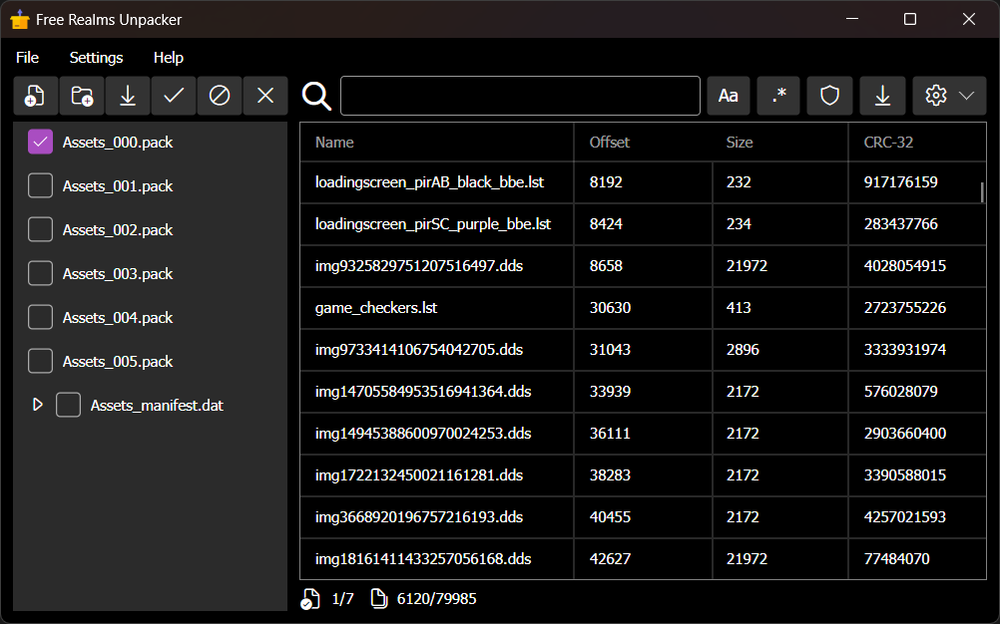

# FreeRealmsUnpacker
An application that allows you to browse, extract, and validate assets from Free Realms asset files.

CLI:
```
Usage: FreeRealmsUnpackerCLI [options] <InputDirectory/AssetFile> <OutputDirectory>

Arguments:
  InputDirectory/AssetFile      The Free Realms client directory or asset file.
  OutputDirectory               The destination for extracted assets.
                                Default value is: ./assets.

Options:
  -g|--extract-game             Extract game assets only (in 'Free Realms/').
  -t|--extract-tcg              Extract TCG assets only (in 'Free Realms/assets/').
  -r|--extract-resource         Extract resource assets only (in 'Free Realms/tcg/').
  -3|--extract-ps3              Extract PS3 assets only (in 'NPUA30048/USRDIR/' or 'NPEA00299/USRDIR').
  -u|--extract-unknown          Extract unknown assets only (disabled by default).
  -p|--extract-pack             Extract .pack assets only.
  -d|--extract-dat              Extract .dat assets only.
  -i|--ignore-temp              Ignore .temp asset files.
  -l|--list-assets              List the assets without extracting them.
  -f|--list-files               List the asset file paths without extracting them.
  -v|--validate-assets          Validate the assets without extracting them.
  -c|--count-assets             Count the assets without extracting them.
  -C|--display-csv              Display listed information as comma-separated values.
  -#|--display-table            Display listed information in a table.
  -H|--handle-conflicts <MODE>  Specify how to handle assets with conflicting names.
                                Allowed values are: Overwrite, Skip, Rename, MkDir, MkSubdir, MkTree.
                                Default value is: Overwrite.
  -n|--no-progress-bars         Do not show progress bars.
  -y|--answer-yes               Automatically answer yes to any question.
  -D|--debug                    Show complete exception stack traces.
  -?|-h|--help                  Show help information.
```

GUI:


## Credits

<a href="https://www.freepik.com/icon/package_1170846">Icon by Freepik</a>
